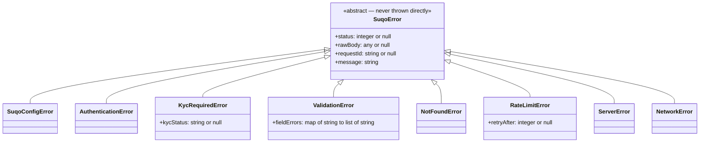
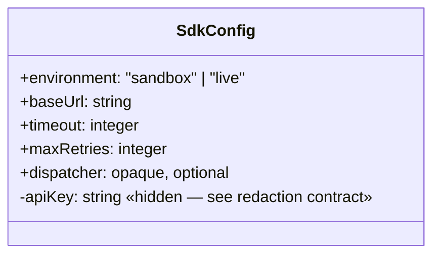
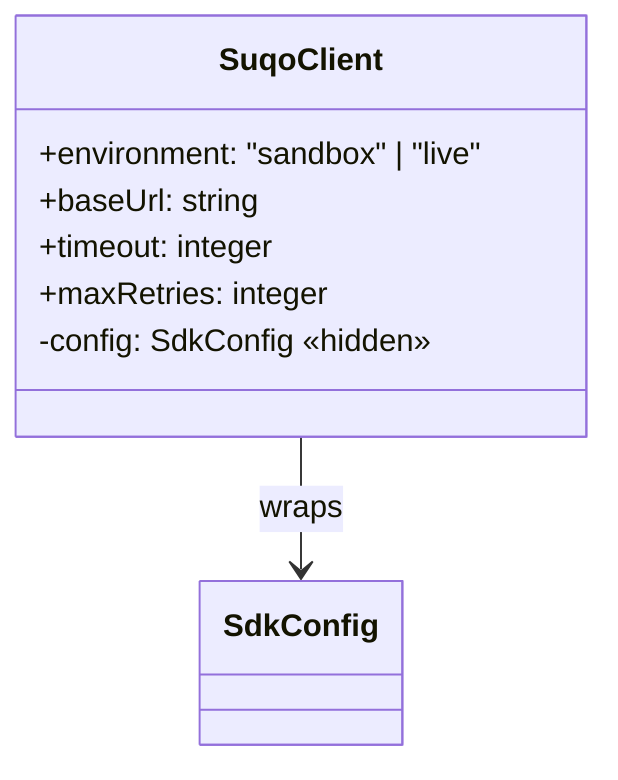

# Design Doc — Ticket 1: Errors, Config & Client Shell

**Status:** Draft — backfilled after implementation, proposed as the template for future tickets.
**Audience:** any language SDK team (TypeScript, Python, PHP, …). Nothing below is TypeScript-specific;
where the current implementation makes a TS-specific choice, it's called out separately so another
language can make its own idiomatic equivalent.

---

## 1. Spec alignment

This ticket implements:

- **SDK-SPEC.md §2** — environment inference from the API key prefix.
- **SDK-SPEC.md §4** — authentication (single bearer key) and key redaction.
- **SDK-SPEC.md §7** — the full error taxonomy and the dual-shape error mapper.
- **typescript-addendum.md §5** — the concrete client constructor shape (this addendum is
  TS-specific by definition; every other language SDK writes its own addendum, but the *shape*
  described below is what that addendum should target).

No other spec section is touched by this ticket. `.products`/`.subscriptions`/etc. (§5's resource
methods) are explicitly out of scope — see Ticket 4.

---

## 2. Decomposition

This ticket splits into three independently designable pieces, built in this order because each
depends on the previous one:

| Step | Piece | Depends on |
|---|---|---|
| A | Error hierarchy | nothing |
| B | Configuration & environment resolution | Step A (config errors are part of the hierarchy) |
| C | Client shell | Step B (the client wraps config) |

Each step below gets its own class diagram, contract, and conformance checklist. This is the
granularity every future language SDK should replicate — not necessarily the same *file*
boundaries (that's an implementation detail), but the same *conceptual* boundaries.

---

## Step A — Error hierarchy

### Class diagram



### Contracts

| Class | Triggered by | Carries | Notes |
|---|---|---|---|
| `SuqoError` | never thrown directly | `status`, `rawBody`, `requestId`, `message` | Base of every error the SDK throws. A catch-all `instanceof`/`isinstance` check against this class must catch everything. |
| `SuqoConfigError` | construction-time only: malformed API key, or an explicit environment override that disagrees with the key | nothing extra | Never carries `status`/`rawBody` — there was no request to get them from. Thrown **before** any network call. |
| `AuthenticationError` | HTTP 401 | nothing extra | Message comes from the response body's `detail` field. |
| `KycRequiredError` | HTTP 403 | `kycStatus` | `kycStatus` comes from the response body's `status_code` field (the KYC status). Named `kycStatus`, not `statusCode` — per SDK Naming Map v1.1's rename register, `status_code` "reads as an HTTP status but carries a KYC status," and sits right next to the base class's real HTTP `status` field. Every 403 in this API is a KYC condition — there is no separate generic "forbidden" class. |
| `ValidationError` | HTTP 400 | `fieldErrors` | See the dual-shape mapping rule below — this is the one class with real decision logic behind it. |
| `NotFoundError` | HTTP 404 | nothing extra | |
| `RateLimitError` | HTTP 429 | `retryAfter` | **Reserved** — the API doesn't enforce rate limits yet, so this is never thrown today. Exists so the SDK is forward-ready. Named `retryAfter`, not `retryAfterMs`, per SDK Naming Map v1.1 (SDK-surface fields drop the `Ms` suffix). |
| `ServerError` | HTTP 5xx, and any genuinely unmapped status | nothing extra | See "design decisions" below for why unmapped codes land here instead of the base class. |
| `NetworkError` | transport failure, timeout, or a caller-initiated cancellation | nothing extra | Covers all three — there's no separate timeout or cancellation class. |

### The error-mapping function

This isn't a class — it's a **pure function contract** every language SDK must implement
identically:

```
function mapHttpError(status, statusText, body, requestId?, retryAfter?) -> SuqoError subclass
```

Decision table (evaluate top to bottom, first match wins). Fallback message strings are given
**verbatim** — every language SDK should produce the same wording, not just the same class, so a
developer switching languages sees identical error text:

| status | body shape | → | Fallback message (if the body doesn't supply one) |
|---|---|---|---|
| 401 | `{ detail }` | `AuthenticationError(message = body.detail)` | `"Request failed with status 401"` |
| 403 | `{ status_code, message }` | `KycRequiredError(message = body.message, kycStatus = body.status_code)` | `"KYC verification needed to perform this action."` |
| 400 | `{ detail }` present | `ValidationError(message = body.detail, fieldErrors = {})` | — (detail is required for this branch to match at all) |
| 400 | field-keyed (`{ field: "msg" \| ["msg"] }`) | `ValidationError(message = fallback, fieldErrors = normalized(body))` | `"Validation failed."` |
| 404 | `{ detail }` | `NotFoundError(message = body.detail)` | `"Not found."` |
| 429 | any | `RateLimitError(message, retryAfter)` | `"Request failed with status 429"` |
| 5xx, or anything else | any | `ServerError(message)` | `"Request failed with status {status}"` (+ ` ({statusText})` if available) |

**Field-value normalization rule** (used by the 400 field-keyed branch): a field's value may
arrive as a single string or an array of strings on the wire; the mapper must normalize it to a
list of strings either way. A value that's neither a string, a string array, nor a nested object
(see below) is dropped from the result rather than guessed at.

**Customer-boundary rewrite rule (SDK Naming Map v1.1 Open Question A, resolved 2026-08-24):** the
wire's root-level `client` key is renamed to `customer`, and — because a validation failure on a
nested field comes back as a real nested object rather than a flat dotted key (confirmed live:
`{"client": {"phone": ["This field is required."]}}`) — the mapper recurses into any nested
object value, flattening it into dot-path keys (`customer.phone`). This rewrite fires only for the
exact root-level `client` key; a field genuinely named `client` nested somewhere else (none exist
in the documented API surface today) is left untouched.

**Shape-detection rule**: a body is "detail-shaped" if and only if it has a `detail` key. This is
reliable because the API never uses `detail` as an actual field name in the field-keyed shape.

### Conformance checklist — Step A

A language implementation is correct if and only if all of these hold:

- [ ] Every one of the 8 subclasses is an instance of the base class (a single catch-all check
      catches everything).
- [ ] The base class itself is never thrown by any SDK-internal code path.
- [ ] 401/403/404/429/5xx map to the correct class per the table above, using the correct fallback
      message text when the body doesn't supply one.
- [ ] A 400 with a `detail` key produces `fieldErrors` = empty, `message` = that detail text.
- [ ] A 400 with field-keyed data produces `fieldErrors` populated, `message` = the literal
      fallback `"Validation failed."` (not something derived from the fields).
- [ ] A field-keyed 400 with a nested `client` object (e.g. `{"client": {"phone": [...]}}`)
      produces `fieldErrors["customer.phone"]`, not `fieldErrors["client"]` or a dropped value.
- [ ] A `client` key nested inside some other field (not at the root) is left as-is, unrenamed.
- [ ] A field's array-of-strings value survives unchanged; a plain-string value becomes a
      one-element list; a non-string/array value is dropped, not coerced.
- [ ] `KycRequiredError.kycStatus` is unset (not an empty string) when the body has no
      `status_code`.

---

## Step B — Configuration & environment resolution

### Class diagram



### Constructor input contract

This is what goes **in** — distinct from the fields shown above, which is what the object exposes
**after** construction:

| Input field | Type | Required? | Default if omitted |
|---|---|---|---|
| `apiKey` | string | **yes** | — |
| `baseUrl` | string | no | inferred from `apiKey`'s prefix |
| `timeout` | integer | no | `30000` |
| `maxRetries` | integer | no | `2` |
| `dispatcher` | opaque/implementation-defined | no | none |

Nothing else is accepted. In particular, there is **no** raw `environment` field a caller can set
directly — the only way to select an environment is through the key's prefix (the algorithm
below), optionally cross-checked against `baseUrl`.

### The environment-inference algorithm

This is the single most important contract in the whole SDK — every language must implement it
identically, in this exact order:

```
function resolveEnvironment(apiKey, override?) -> { environment, baseUrl }

1. If apiKey is empty or not a string → throw SuqoConfigError("A SUQO API key is required.")
2. If apiKey starts with "su_test_key_" → environment = sandbox, baseUrl = https://test.be.suqo.ai
3. Else if apiKey starts with "su_key_"  → environment = live,    baseUrl = https://be.suqo.ai
4. Else → throw SuqoConfigError('Malformed SUQO API key: expected prefix "su_key_" (live) or
   "su_test_key_" (sandbox).')
5. If override is provided AND override != the baseUrl chosen above →
   throw SuqoConfigError("Environment mismatch: key implies {baseUrl} but baseUrl was set to
   {override}. Remove baseUrl or use a matching key.")
6. Return { environment, baseUrl: override ?? the baseUrl chosen above }
```

**Order matters**: step 2 (test prefix) MUST be checked before step 3 (live prefix) — mandated by
SDK-SPEC.md §2 rule 4, independent of whether a given language's string-matching could theoretically
confuse the two.

### The key-redaction contract

This is a **requirement**, not an implementation:

> The API key must never appear in whatever this language's default "print/stringify/debug this
> object" mechanism produces for `SdkConfig` or the client object that wraps it.

How each language satisfies this is an implementation detail:
- TypeScript: a true private class field (`#apiKey`), plus an explicit `toJSON()` and a
  `util.inspect` custom-symbol override that both redact it.
- Python: a name-mangled attribute (`_SdkConfig__api_key`) plus overriding `__repr__`/`__str__`.
- PHP: a `private` property plus overriding `__debugInfo()`.

The *test* every language must pass is the same regardless of mechanism: serialize/print/log the
config object and assert the raw key string is not present anywhere in the output.

### Defaults

| Field | Default | Overridable |
|---|---|---|
| `timeout` | 30000 | per-client, and per-call (Ticket 2) |
| `maxRetries` | 2 | per-client |

### Conformance checklist — Step B

- [ ] `su_test_key_…` → `environment = "sandbox"`, `baseUrl = "https://test.be.suqo.ai"`.
- [ ] `su_key_…` → `environment = "live"`, `baseUrl = "https://be.suqo.ai"`.
- [ ] An empty string or non-string `apiKey` throws `SuqoConfigError`, not a lower-level type error.
- [ ] A key matching neither prefix throws `SuqoConfigError` with the exact malformed-key message.
- [ ] A `baseUrl` override equal to the inferred URL is accepted silently.
- [ ] A `baseUrl` override that disagrees with the inferred URL throws `SuqoConfigError` — it is
      never silently accepted or silently ignored.
- [ ] `timeout`/`maxRetries` default to `30000`/`2` when omitted, and honor an explicit value
      when given.
- [ ] Serializing/printing/logging the constructed object never contains the raw key string.

---

## Step C — Client shell

### Class diagram



### Constructor input contract

Identical to `SdkConfig`'s constructor input contract (Step B) — the client accepts exactly the
same fields and passes them straight through. This is deliberate: a caller never constructs
`SdkConfig` directly (see design decision 3 below), so `SuqoClient`'s constructor **is** the only
public entry point for that input shape.

### Contract

- Construction either succeeds completely or throws `SuqoConfigError` — there is no partially-
  constructed state.
- Exposes `environment`, `baseUrl`, `timeout`, `maxRetries` as read-only fields for
  introspection/debugging. Does **not** expose the raw API key as a public field — see Step B's
  redaction contract, which applies to the client too, not just the config it wraps.
- At this stage, exposes nothing else. `.products`, `.subscriptions`, `.customers`, `.webhooks`
  attach in a later step (Ticket 4) — this class is deliberately kept minimal so those later
  additions don't require redesigning it.

### Conformance checklist — Step C

- [ ] `new SuqoClient({ apiKey })` (or the equivalent idiomatic construction call) behaves
      identically to constructing `SdkConfig` directly with the same input, for every case in
      Step B's checklist.
- [ ] The raw key never appears in the client's own serialize/print/log output either — not just
      the config's.
- [ ] No `.products`/`.subscriptions`/etc. exist on the client yet.

---

## Design decisions & rationale

Judgment calls made during this ticket that every future language SDK should make the *same* way,
for consistency — not because the spec forces a unique answer, but because a developer switching
between language SDKs should see identical behavior:

1. **No `code` string property on errors.** Some error-hierarchy designs add a stable string code
   (e.g. `"validation_error"`) alongside the class itself. This design deliberately omits it —
   `SDK-SPEC.md` §7's whole model is "check the class, not a wire-shape-derived string." Adding one
   anyway would give two ways to do the same check and invite them to drift.

2. **An unmapped/out-of-contract HTTP status maps to `ServerError`, not the base `SuqoError`.**
   The base class is documented as "never thrown directly." Since the documented API surface only
   ever returns 400/401/403/404/429/5xx, this case shouldn't occur in practice — but every language
   needs a defined fallback, and `ServerError` is the least-wrong bucket for "the API did something
   we don't have a class for."

3. **`SdkConfig` (or its equivalent) is not part of the public API.** Only the client class is
   public. This matches `SDK-SPEC.md` §5's public surface, which only ever shows client
   construction, never a separate config object being constructed directly.

4. **Renamed `KycRequiredError.statusCode`→`kycStatus`, `RateLimitError.retryAfterMs`→
   `retryAfter`, and `SdkConfig`/`SuqoClientOptions.timeoutMs`→`timeout` (2026-08-21).** SDK
   Naming Map v1.1's rename register calls out `statusCode` by name — it "reads as an HTTP status
   but carries a KYC status," and sits right next to the base class's real HTTP `status` field, so
   the two must stay visibly distinct. The `Ms`-suffix drops (`retryAfterMs`→`retryAfter`,
   `timeoutMs`→`timeout`) follow the map's general rule that SDK-surface fields document their
   unit rather than encoding it in the name. Purely renames — no field, no wire shape, no behavior
   changed. See Ticket 2's design doc for the retry-constant value fix and the `parseRetryAfterMs`
   HTTP-date functional fix that shipped alongside these renames. Applied retroactively to
   already-shipped code, since this document and the map are both meant to be the same source of
   truth going forward.

5. **Field-error keys ARE translated `client`→`customer`, path-aware (2026-08-24).** SDK Naming
   Map v1.1 left this genuinely open ("Open Question A") — even the map's own author didn't have
   an answer yet. Resolved by two things, in order: the lead's explicit call ("we need to rewrite
   error keys to customer"), then confirming live against `POST /subscriptions/` that a nested
   validation failure comes back as a real nested object
   (`{"client": {"phone": ["This field is required."]}}`), not a flat dotted key — which settled
   *how* to implement it, not just *whether* to. A flat key-swap would have silently dropped this
   case entirely, since the old normalization rule only accepted a string or string-array value
   per field, never a nested object.

---

## What's intentionally not in this doc

- Retry/timeout/backoff design — that's Ticket 2's own design doc.
- Resource methods (`products.list()`, etc.) — Ticket 4.
- The pre-push git hook added during this ticket's review — that's tooling, not a class design, so
  it's out of scope for this document.
