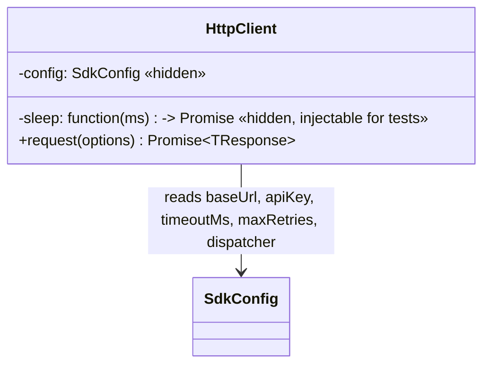

# Design Doc — Ticket 2: HTTP Client (Retries, Timeouts, Cancellation)

**Status:** Draft — backfilled after implementation.
**Audience:** any language SDK team (TypeScript, Python, PHP, …). Nothing below is TypeScript-specific;
where the current implementation makes a TS-specific choice, it's called out separately so another
language can make its own idiomatic equivalent.

---

## 1. Spec alignment

This ticket implements:

- **SDK-SPEC.md §3** — the trailing-slash guarantee on every built URL.
- **SDK-SPEC.md §4** — the `Authorization`/`Content-Type` headers on every request.
- **SDK-SPEC.md §8** — timeouts, and the read-only retry policy (backoff, `Retry-After`).
- **SDK-SPEC.md §12** — the idempotency backlog note: writes are not retried today, and the retry
  policy must be a single, clearly-marked switch so it flips in one place once idempotency ships.
- **typescript-addendum.md §2** — the concrete choice of `fetch` + `AbortSignal.timeout` (TS-specific
  mechanism; every language SDK picks its own equivalent HTTP client and cancellation primitive).

Cancellation support and the exact bug list below were **not** originally in the spec — they were
added during this ticket in response to review feedback, then folded back into this design as the
correct, final shape. `mapHttpError` and the `SuqoError` hierarchy are Ticket 1's design; this
ticket only consumes them, it doesn't redefine them.

---

## 2. Decomposition

Four independently designable pieces, in dependency order:

| Step | Piece | Depends on |
|---|---|---|
| A | URL building | nothing |
| B | Retry policy | nothing |
| C | Signal combining (cancellation primitive) | nothing |
| D | The HTTP client itself | A, B, C, and Ticket 1's error hierarchy |

A, B, and C are deliberately pure and independent of each other and of any networking — they're
the kind of piece a language team can design and test in isolation before touching D at all.

---

## Step A — URL building

### Function contract

```
function buildUrl(baseUrl, path, query?) -> string
```

| Rule | Detail |
|---|---|
| Trailing slash | If `path` doesn't already end in `/`, one is added. Never assume the caller got it right — this is the SDK's last line of defense for SDK-SPEC.md §3, not a courtesy. |
| Query placement | Query parameters are appended **after** the trailing slash: `.../products/?page=2`. |
| Omitted values | A query value that is absent/null is skipped entirely, not sent as an empty parameter — so a caller can pass `{ page, pageSize }` straight through without pre-filtering. |

### Conformance checklist — Step A

- [ ] `buildUrl(base, "/api/v1/products")` → ends in `/api/v1/products/`.
- [ ] `buildUrl(base, "/api/v1/products/")` → unchanged, not doubled to `//`.
- [ ] Query parameters land after the slash, in the order given.
- [ ] A query value that's absent produces no parameter at all for that key.

---

## Step B — Retry policy

Three pure decisions plus one pure calculation — no networking, no classes, just functions and a
couple of named constants.

### Function contracts

```
function isRetryableMethod(method) -> boolean
function isRetryableFailure(networkError: boolean, status?: integer) -> boolean
function backoffDelayMs(attempt: integer) -> integer
function parseRetryAfterMs(headerValue: string or null) -> integer or undefined
```

| Function | Rule |
|---|---|
| `isRetryableMethod` | **Single switch** (SDK-SPEC.md §8, §12): only `GET` returns `true` today. Every read in this API is `GET`, every write is `POST`; writes never retry because the backend has no idempotency keys yet. The moment it does, this is the one function that flips. |
| `isRetryableFailure` | `true` if there was no response at all (network failure), or if the response status is `429`, or a `5xx`. `false` for everything else (400/401/403/404). |
| `backoffDelayMs(attempt)` | "Full jitter": a random value between `0` and `min(MAX_DELAY_MS, BASE_DELAY_MS × 2^attempt)`. `BASE_DELAY_MS = 200`, `MAX_DELAY_MS = 5000`. `attempt` is 0-indexed (0 = the first retry). |
| `parseRetryAfterMs` | Parses the numeric-seconds form of a `Retry-After` header into milliseconds, clamped to `MAX_RETRY_AFTER_MS = 60000`. Returns "unparseable" (not `0`) for: a `null`/missing header, a negative value, a non-numeric value, **and an empty or whitespace-only value** — a naive `string-to-number` cast in several languages (JavaScript included) turns `""` into `0`, which must be special-cased explicitly rather than trusted. |

### Conformance checklist — Step B

- [ ] `isRetryableMethod("GET")` is `true`; `isRetryableMethod("POST")` is `false`.
- [ ] A network failure (no response) is always retryable.
- [ ] `429` and every `5xx` are retryable; `400`/`401`/`403`/`404` are not.
- [ ] `backoffDelayMs(0)` never exceeds `200`; `backoffDelayMs` at a high attempt number never
      exceeds `5000` regardless of how large the exponent grows.
- [ ] `parseRetryAfterMs("5")` → `5000`. `parseRetryAfterMs("86400")` → clamped to `60000`, not the
      literal day-long value. `parseRetryAfterMs("")`, `parseRetryAfterMs("   ")`, and
      `parseRetryAfterMs(null)` all → "unparseable," never `0`.

---

## Step C — Signal combining (the cancellation primitive)

Every language needs *some* way to say "stop this in-flight operation." This step defines the
shape of that primitive independently of HTTP.

### Function contract

```
function combineSignals(signals: list of Signal-or-null) -> { signal: Signal, cleanup: () -> void }
```

| Rule | Detail |
|---|---|
| Combining | The returned `signal` fires as soon as **any** input signal fires. If one is already fired at call time, the returned signal is immediately in the fired state too. |
| Cleanup is mandatory | Every listener this function attaches to an input signal **must** be removed once the combined signal is no longer needed — call `cleanup()` when the operation it was guarding finishes, on every exit path (success, failure, or the signal firing). Skipping this leaks one listener per call on any long-lived signal a caller reuses across multiple operations (e.g. one signal shared across a paginated series of calls). |

This exact shape exists because of a real bug: an earlier version of Step D combined signals
inline without a cleanup step, and leaked a listener on the caller's signal every single retry
attempt.

### Conformance checklist — Step C

- [ ] The combined signal fires when any one input fires, and carries that input's reason/cause.
- [ ] An already-fired input signal produces an already-fired combined signal, not a delayed one.
- [ ] `undefined`/`null` entries in the input list are ignored, not errors.
- [ ] After `cleanup()` is called, firing an input signal that didn't already fire has **no**
      further effect — precisely provable by asserting the listener count on that input signal is
      `0` after cleanup, not just "the program didn't crash."

---

## Step D — The HTTP client

### Class diagram



### Constructor input contract

| Input field | Type | Required? |
|---|---|---|
| `config` | `SdkConfig` (Ticket 1) | yes |
| `sleep` | function, `(ms) -> Promise/void` | no — defaults to a real timed wait; overridable so tests don't wait through real delays |

### `request()`'s input contract

`request()` takes one options object per call:

| Field | Type | Required? | Notes |
|---|---|---|---|
| `method` | `"GET"` or `"POST"` | yes | Every route in this API is one of these two. |
| `path` | string | yes | Passed through `buildUrl` (Step A) — never pre-slash it yourself. |
| `query` | map of string to scalar, optional | no | Same omission rule as Step A. |
| `body` | request-shape, generic | **only on `POST`** | A `GET` cannot carry a body — enforced at the type level where the language supports it (a union/variant type with two cases, one per method), and defensively at runtime regardless, so a caller that bypasses the type system still fails loudly and immediately rather than the request reaching the network layer malformed. |
| `timeoutMs` | integer, optional | no | Defaults to `SdkConfig.timeoutMs`. Bounds each individual attempt, not the whole call including retries. |
| `signal` | Signal, optional | no | Caller-supplied cancellation (Step C). Combined with the per-attempt timeout signal. |

### The request algorithm

```
function request(options) -> TResponse:
  reject immediately if options.method == "GET" and options.body is present

  url = buildUrl(config.baseUrl, options.path, options.query)
  retryable = isRetryableMethod(options.method)
  maxAttempts = retryable ? config.maxRetries + 1 : 1
  timeoutMs = options.timeoutMs ?? config.timeoutMs

  for attempt = 1, 2, 3, ... :
    isLastAttempt = attempt >= maxAttempts

    try:
      response = doFetch(url, options, timeoutMs)   # see below

      if response.ok:
        return parse(response.body)

      body = parse(response.body)                    # a read failure here is treated as a
                                                       # network failure below, not swallowed
      retryAfterMs = response.status == 429 ? parseRetryAfterMs(header) : undefined

      if not isLastAttempt and retryable and isRetryableFailure(false, response.status):
        sleepOrAbort(retryAfterMs ?? backoffDelayMs(attempt - 1), options.signal)
        continue

      throw mapHttpError(response.status, response.statusText, body, retryAfterMs)  # Ticket 1

    catch cause:
      if cause is already a mapped SDK error: rethrow unchanged   # don't reclassify a final decision
      callerCancelled = options.signal is fired
      if not callerCancelled and not isLastAttempt and retryable and isRetryableFailure(true):
        sleepOrAbort(backoffDelayMs(attempt - 1), options.signal)
        continue
      throw toNetworkError(cause, timeoutMs, callerCancelled)

doFetch(url, options, timeoutMs):
  headers = { Authorization: "Bearer " + config.apiKey }
  if options.method != "GET": headers["Content-Type"] = "application/json"
  { signal, cleanup } = combineSignals([timeout-signal(timeoutMs), options.signal])
  try:
    return http_call(url, options.method, headers, options.body, signal, config.dispatcher)
  finally:
    cleanup()   # always, on every exit path — see Step C
```

`sleepOrAbort(ms, signal)` waits `ms`, but rejects immediately — before the full wait elapses — if
`signal` fires during the wait. A caller cancelling mid-backoff does not have to wait for the
sleep to finish first.

### Conformance checklist — Step D

- [ ] Every request carries `Authorization: Bearer <key>`.
- [ ] Every non-`GET` request carries `Content-Type: application/json`, **even when it has no
      body** (e.g. a bodyless write) — the header is tied to the method, not to body presence.
- [ ] A `GET` with a body is rejected before any network call is attempted, both when caught by
      the type system and when the type system is bypassed.
- [ ] A read that fails with a network error, `429`, or `5xx` is retried up to
      `config.maxRetries` additional times; a write never retries regardless of the failure.
- [ ] A response-body read failure (the connection succeeds, then dies while streaming the body)
      is retried/mapped exactly like a `doFetch` failure — it never escapes as an unmapped error.
- [ ] A `429` with a valid `Retry-After` sleeps that value instead of the computed backoff; an
      invalid/absent one falls back to computed backoff.
- [ ] Cancelling via `options.signal` — whether before the call starts, during the network call,
      or during a retry's backoff wait — always ends the call with a "cancelled" error and never
      triggers a further retry attempt.
- [ ] `cleanup()` (Step C) runs after every single attempt, success or failure, so a signal reused
      across many calls never accumulates listeners.

---

## Design decisions & rationale

1. **Timeout bounds each attempt, not the whole call.** With defaults (30s timeout, 2 retries), a
   slow backend could make one `request()` call take well over a minute end to end. This was a
   deliberate choice, not an oversight — each retry attempt needs its own full timeout budget, the
   same way most HTTP client libraries handle it — but it's worth stating explicitly since the
   alternative (an overall deadline across all attempts) is an equally reasonable design a
   language team might otherwise default to without realizing there's a choice here at all.

2. **A caller cancellation is never retried, even for an otherwise-retryable read.** Retrying
   after the caller explicitly asked to stop would silently ignore what they asked for. This is
   treated as categorically different from a network failure, even though both surface as the
   same error class (`NetworkError`).

3. **The retry-eligibility decision always routes through `isRetryableFailure`, never inlined.**
   Even the "a network failure is always retryable" case — which looks like a constant — must
   call through the function rather than hardcode `true` at the call site. Two code paths encoding
   the same policy independently will eventually drift if the policy ever changes in only one of
   them.

---

## What's intentionally not in this doc

- The `SuqoError` hierarchy and `mapHttpError` — Ticket 1's design doc.
- Resource methods that will call `HttpClient.request()` (`products.list()`, etc.) — Ticket 4.
- Contract/mock-server testing strategy — Ticket 7.
