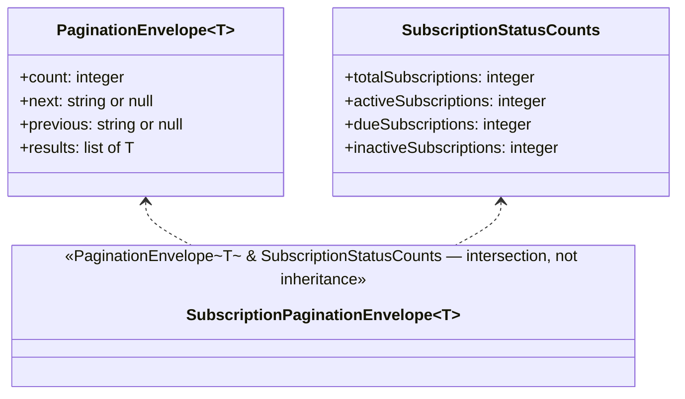

# Design Doc — Ticket 3: Pagination

**Status:** Draft.
**Audience:** any language SDK team (TypeScript, Python, PHP, …). Nothing below is TypeScript-specific;
where the current implementation makes a TS-specific choice, it's called out separately so another
language can make its own idiomatic equivalent.

---

## 1. Spec alignment

This ticket implements:

- **SDK-SPEC.md §6** — the page-number pagination envelope, the Subscriptions-specific count
  extension, and the auto-iterator requirement ("SHOULD provide an auto-iterator... manual
  `page`/`pageSize` access remains available").
- **openapi.yaml's `PaginationEnvelope`/`SubscriptionListEnvelope`/`Page`/`PageSize` parameters** —
  the exact field names and query param names this ticket's types and mapping must match.

This ticket also **found and fixed a real bug in Ticket 2's `buildUrl`** while building against
it — see "Design decisions & rationale" below. That fix lives in `http/urlBuilder.ts`, not this
file, but is recorded here since this ticket is what surfaced it.

---

## 2. Decomposition

| Step | Piece | Depends on |
|---|---|---|
| A | Pagination envelope types | nothing |
| B | Page-param mapping | Ticket 2's `QueryParams` type |
| C | `listAll()` auto-iterator | Step A (operates on its types) |

All three are pure — no networking, no classes with behavior, just types and one generator
function. None of it is wired to a real resource yet; that's Ticket 4.

---

## Step A — Pagination envelope types

### Type diagram



### Contracts

| Type | Shape | Notes |
|---|---|---|
| `PaginationEnvelope<T>` | `count`, `next`, `previous`, `results` | The common shape every list endpoint returns. `T` is left generic on purpose — this file never needs to know about `Product`, `Subscription`, etc. |
| `SubscriptionStatusCounts` | the 4 extra counts | Exists as its own named type (not inlined) so it can be combined with the base envelope without duplicating field definitions. |
| `SubscriptionPaginationEnvelope<T>` | `PaginationEnvelope<T> & SubscriptionStatusCounts` | **Composed by intersection, not by subclassing.** The 4 extra counts sit *alongside* `results`, never replacing or restructuring the common envelope — a consumer that only knows about `PaginationEnvelope<T>` can still read `count`/`next`/`previous`/`results` off a `SubscriptionPaginationEnvelope<T>` value without any special-casing. |

### Conformance checklist — Step A

- [ ] A products-style envelope (no extra counts) type-checks against `PaginationEnvelope<T>` with
      no unused/missing-field errors.
- [ ] A subscriptions-style envelope (with the 4 extra counts) type-checks against
      `SubscriptionPaginationEnvelope<T>` and *also* satisfies `PaginationEnvelope<T>` on its own
      — the extension must never break structural compatibility with the base shape.
- [ ] The 4 extra count field names match `openapi.yaml`'s `SubscriptionListEnvelope` exactly
      (case-mapped per language): `total_subscriptions`, `active_subscriptions`,
      `due_subscriptions`, `inactive_subscriptions`.

---

## Step B — Page-param mapping

### Function contract

```
function toPageQuery(params?: { page?: integer, pageSize?: integer }) -> { page, page_size }
```

| Rule | Detail |
|---|---|
| Mapping | `pageSize` → `page_size` (camelCase → the wire's snake_case). |
| Omission | A field the caller didn't supply is passed through as absent/undefined in the output — not defaulted here. The server applies its own defaults (`page` = 1, `page_size` = 20) when a param is truly missing from the request. |
| Reuse | Every future paginated resource method shares this one mapping function rather than each re-deriving `pageSize → page_size` independently. |

### Conformance checklist — Step B

- [ ] `toPageQuery({ page: 2, pageSize: 50 })` → `{ page: 2, page_size: 50 }`.
- [ ] `toPageQuery()` (no args) → both fields absent/undefined, not defaulted to `1`/`20` client-side.
- [ ] `toPageQuery({ page: 3 })` → `page_size` absent, not forced to some default.

---

## Step C — `listAll()` auto-iterator

### Function contract

```
function listAll<T>(
  firstPage: PaginationEnvelope<T>,
  fetchNext: (nextUrl: string) -> Promise<PaginationEnvelope<T>>,
  maxPages: integer = 10000,
) -> AsyncIterator<T>
```

| Rule | Detail |
|---|---|
| Decoupling | `listAll` takes the already-fetched first page and a `fetchNext` callback — it never makes an HTTP call itself, and never imports anything from the HTTP layer. This is deliberate: it keeps pagination testable and reusable across every future paginated resource without needing to know how requests are actually made. Ticket 4 supplies the real `fetchNext` (backed by the language's actual HTTP client) when it wires this to a resource. |
| Termination | Yields every item of the current page, then — if `next` is `null` — stops. Otherwise calls `fetchNext(next)` and repeats. |
| Safety cap | `maxPages` (default 10,000) bounds how many pages the loop will follow before giving up and raising an error, rather than trusting the sequence to terminate forever. This exists because of a real bug: an earlier version had no such cap, and a stuck `fetchNext` (or a misbehaving server) would hang the iterator indefinitely with unbounded memory growth. 10,000 is generous enough that no realistic dataset trips it, while still catching a genuine stuck loop. |
| Manual access stays available | This iterator is additive. A caller who wants to manage `page`/`pageSize` manually (via Step B) never has to touch this function at all — SDK-SPEC.md §6 requires both paths to keep working side by side. |

### Conformance checklist — Step C

- [ ] A single-page result (`next: null` from the start) yields every item and never calls `fetchNext`.
- [ ] A multi-page sequence yields every item across every page, calling `fetchNext` with the exact
      `next` value from the previous page each time, and stops the moment `next` is `null`.
- [ ] An empty page (`results: []`, `next: null`) yields nothing and never calls `fetchNext`.
- [ ] A sequence that never reaches `next: null` throws once `maxPages` is exceeded, rather than
      iterating forever.
- [ ] A legitimate sequence well under `maxPages` is never falsely flagged.
- [ ] The iterator behaves identically whether the envelope is a plain `PaginationEnvelope<T>` or
      a `SubscriptionPaginationEnvelope<T>` — the extra counts must never interfere with iteration.

---

## Design decisions & rationale

1. **`listAll` is decoupled from the HTTP layer on purpose.** An alternative design would have
   `listAll` take a `baseUrl` and call the HTTP client directly. That would make this file harder
   to test in isolation and would tie pagination logic to one specific HTTP implementation. Taking
   `fetchNext` as a callback keeps the two concerns — "how do I get the next page" and "what do I
   do once I have it" — genuinely separate.

2. **A real bug was found in `buildUrl` (Ticket 2) while building this ticket, not before.**
   `fetchNext`'s contract expects to be handed the API's actual `next` URL — which is already a
   complete absolute URL with its own query string attached (e.g.
   `.../subscriptions/?page=2&page_size=50`). `buildUrl` originally checked "does the raw input
   string end in `/`" *before* parsing it as a URL, which is meaningless once a query string is
   already attached — it would silently corrupt whichever query parameter happened to be last
   (`page_size=50` became `page_size=50/`). This was fixed in `http/urlBuilder.ts` by checking the
   *parsed pathname* instead of the raw string, so `buildUrl` now correctly handles both a plain
   relative path and an already-complete absolute URL. **Any language implementing `buildUrl`'s
   equivalent should support both input shapes from the start**, now that this ticket has proven
   the pagination `next`-URL-following pattern genuinely needs it.

3. **`maxPages` is a parameter, not a hardcoded constant.** A caller with a genuinely unusual,
   very large dataset (or a deliberately small one, for testing) can override it, rather than
   being stuck with one global value baked into the function.

---

## What's intentionally not in this doc

- `HttpClient`/`buildUrl` themselves — Ticket 2's design doc (updated to reflect the absolute-URL
  fix above).
- How a resource method (`subscriptions.list()`, `.listAll()`) actually wires `fetchNext` to a
  real HTTP call — Ticket 4.
