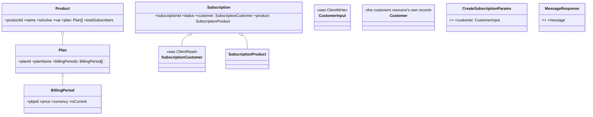
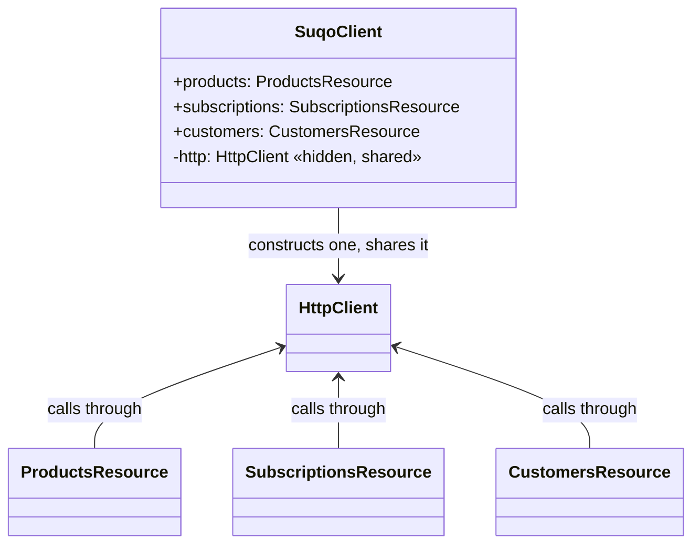

# Design Doc — Ticket 4: Resources

**Status:** Draft — backfilled after implementation.
**Audience:** any language SDK team (TypeScript, Python, PHP, …). Nothing below is TypeScript-specific;
where the current implementation makes a TS-specific choice, it's called out separately so another
language can make its own idiomatic equivalent.

---

## 1. Spec alignment

This ticket implements:

- **SDK-SPEC.md §5** — the actual public resource surface (`products`, `subscriptions`,
  `customers`), camelCase args, decimal-fields-stay-string, the `checkout_url`-is-not-payment
  caveat.
- **SDK-SPEC.md §6** — pagination and the auto-iterator, wired to real endpoints for the first
  time (Ticket 3 built the mechanism; this ticket connects it).
- **SDK-SPEC.md §7** — the first place `mapHttpError`'s classes actually get thrown from a real
  request (Ticket 1 built the mapper; `HttpClient`, Ticket 2, already calls it — this ticket is
  the first to exercise that path end-to-end).
- **`openapi.yaml`** — `listProducts`, `listSubscriptions`, `createSubscription`,
  `cancelSubscription`, `updateBillingCycle`, `resumeSubscription`, `listCustomers`,
  `retrieveCustomer`.
- **SDK Naming Map v1.1** — the customer boundary (§11), the rename register (§12:
  `client`→`customer`, `Message`→`MessageResponse`, `*Request`→`*Params`), and `.autoPaging()`
  (§04).
- **`docs/implementation-plan.md`'s Ticket 4 re-scope notes (2026-08-18)** — Customers upgraded
  from stub to real; `resume` added (confirmed public, shape unverified); `retrieve` deliberately
  excluded (blocked on backend).

---

## 2. Decomposition

| Step | Piece | Depends on |
|---|---|---|
| A | Model types | Tickets 1–3 (errors, pagination) |
| B | Customer↔client serialization boundary | Step A |
| C | Per-resource wire deserialization | Step A |
| D | `products` resource | Steps A, C |
| E | `customers` resource | Steps A, C |
| F | `subscriptions` resource | Steps A, B, C |
| G | Wiring onto `SuqoClient` + public exports | Steps D, E, F |

---

## Step A — Model types

### Type diagram



### Contracts

| Type | Notes |
|---|---|
| `Product`/`Plan`/`BillingPeriod` | Field-for-field mirror of `openapi.yaml`, camelCased. No renames. |
| `SubscriptionCustomer` / `CustomerInput` / `Customer` | Three distinct types, not one — the read shape embedded on a subscription, the write shape passed to `create()`, and the `customers` resource's own full record are genuinely different. Naming the embedded shape `Customer` would collide the moment the resource's own record needed that name too. |
| `SubscriptionStatus` | A constant object + a **widened** union (`known literals \| (string & {})`), not a closed union or a plain enum. SDK Naming Map v1.1 §10 requires an unrecognized status the API adds later to round-trip instead of raising — a closed union would make TypeScript itself reject that value at the type level, defeating the requirement even though runtime code never validated anything. |
| `CreateSubscriptionParams`/`UpdateBillingCycleParams` | Named `*Params`, not `*Request` — the wire schema's own name would read as an HTTP request object. `CreateSubscriptionResponse` is unaffected; the rename only applies to inbound shapes. |
| `MessageResponse` | Named to avoid colliding with `SuqoError.message`, which every error subclass already carries. |

### Conformance checklist — Step A

- [ ] Every model field name is camelCase, and matches its wire counterpart 1:1 except the four
      registered renames above.
- [ ] `SubscriptionStatus`'s six known accessors' values match `openapi.yaml`'s enum strings
      exactly; assigning an arbitrary unrecognized string to a `status` field requires no cast.
- [ ] `SubscriptionCustomer`, `CustomerInput`, and `Customer` remain three separate types — no
      merging or aliasing one to another.

---

## Step B — Customer↔client serialization boundary

### Function contracts

```
function serializeCustomerInput(customer: CustomerInput) -> wire object (ClientWrite shape)
function deserializeSubscriptionCustomer(wire: unknown) -> SubscriptionCustomer
```

| Direction | Rule |
|---|---|
| Write | Root fields (`phone`, `fullName`→`full_name`, `email`, `address`) map 1:1. The nested `billing` object's fields get a `billing_` prefix (`businessName`→`billing_business_name`). The nested `shipping` object's fields do **not** get any prefix. This asymmetry is a real backend quirk — reproduced exactly, not "fixed." |
| Read | Neither nested object carries any prefix at all (`business_name`, not `billing_business_name`). A field of the wrong type, or a missing/malformed nested object, is omitted — never fabricated or thrown on, matching `mapHttpError`'s own best-effort philosophy (Ticket 1). |
| One boundary | This is the **only** place the `client`↔`customer` translation happens. No resource method, error class, or transport code touches it directly. `rawBody` is never translated (R1). |

### Conformance checklist — Step B

- [ ] A round-trip through `serializeCustomerInput` never emits `billing_*`-prefixed keys inside
      `shipping`, or unprefixed keys inside `billing`.
- [ ] `deserializeSubscriptionCustomer` given a `billing_business_name` key (the *write* shape) on
      the read side does **not** surface it — the read and write field-name logic never bleed
      into each other.
- [ ] A non-object wire value returns `{}` rather than throwing.

---

## Step C — Per-resource wire deserialization

**This step exists because of a real bug found before it was ever committed**, not a hypothetical.
An earlier draft of the `products` resource typed `list()`'s return as `Page<Product>`
(camelCase) but never actually converted anything — the real 2xx response body is snake_case, so
at runtime `product.productId` would have been `undefined` while TypeScript insisted it was a
`string`. `HttpClient.request()` (Ticket 2) does not transform response bodies at all — it hands
back the parsed JSON via a type assertion only (`as TResponse`) — so **every** resource is
responsible for converting its own wire shapes explicitly.

| Rule | Detail |
|---|---|
| Wire types stay private | Each resource file declares its own `Wire*` interfaces (e.g. `WireProduct`) matching `openapi.yaml` exactly, snake_case. Not exported — an implementation detail of that one file. |
| Deserializers are explicit, not generic | A hand-written `deserializeX` function per shape, not a generic recursive snake→camel walker. A generic deep converter would risk mangling opaque/unspecified inner shapes (e.g. `BillingPeriod.offers: unknown[]`, whose item shape isn't documented) by "helpfully" re-casing keys it has no business touching. |
| Shared envelope helper | `deserializePage<TWireItem, T>(wire, deserializeItem)` (`pagination.ts`) handles unwrapping `count`/`next`/`previous`/`results` — those three field names already match the wire, only `results`' items need per-resource mapping. The `SubscriptionListEnvelope`'s four extra counts aren't part of `Page<T>`'s shape, so `subscriptions.ts` has its own `deserializeSubscriptionPage` instead of reusing the generic helper. |
| Exported for testing only | Each resource's `deserializeX` functions are exported from their file so they get direct unit tests, but they are **not** re-exported from `src/index.ts` — not part of the public contract. |

### Conformance checklist — Step C

- [ ] Every resource method's returned object contains **zero** snake_case keys — proven by
      asserting the absence of a specific wire key (e.g. `not.toHaveProperty("product_id")`), not
      just asserting the camelCase key is present (which a type-only assertion would pass too).
- [ ] A nested array of objects (`Product.plan[].billingPeriods[]`) is deserialized recursively,
      not just at the top level.

---

## Step D — `products` resource

```
products.list(params?: PageParams) -> Page<Product>
products.autoPaging(params?: PageParams) -> AsyncIterableIterator<Product>
```

The only resource that works before KYC verification (SDK-SPEC.md §5) — no `KycRequiredError`
handling needed here specifically; it still flows through `mapHttpError` like everything else if
the account is somehow otherwise unauthorized.

---

## Step E — `customers` resource

```
customers.list(params?: PageParams) -> Page<Customer>
customers.autoPaging(params?: PageParams) -> AsyncIterableIterator<Customer>
customers.retrieve(id: integer) -> Customer
```

Read-only — no create/update/delete exists on this resource. `id` is an **integer**, not a UUID —
this resource's own confirmed convention (re-verified live against BE Swagger and
`suqo.ai/docs/api/customers`, both agree), not forced into the shape every other resource uses.

---

## Step F — `subscriptions` resource

```
subscriptions.list(params?: PageParams) -> SubscriptionPage<Subscription>
subscriptions.autoPaging(params?: PageParams) -> AsyncIterableIterator<Subscription>
subscriptions.create(params: CreateSubscriptionParams) -> CreateSubscriptionResponse
subscriptions.cancel(id: string) -> MessageResponse
subscriptions.updateBillingCycle(params: UpdateBillingCycleParams) -> MessageResponse
subscriptions.resume(id: string) -> MessageResponse
```

| Rule | Detail |
|---|---|
| `retrieve(id)` is **absent**, not stubbed | Still blocked on a real sample response from backend. Matches the Ticket 0 precedent of not building placeholders for unconfirmed shapes — the method simply doesn't exist yet, rather than existing and throwing. |
| `create()` routes through the customer boundary | `params.customer` is serialized via `serializeCustomerInput` (Step B) and nested under the wire's `client` key. |
| `cancel`/`updateBillingCycle`/`resume` need no deserializer | `MessageResponse`'s one field (`message`) already matches the wire 1:1 — these three call `request<MessageResponse>()` directly. |
| `cancel` is scheduled, not immediate | Confirmed with backend 2026-08-17 — status moves to `pending_cancellation`, stays active until period end. |
| Writes never auto-retry | SDK-SPEC.md §8, §12 — no idempotency keys yet. |

### Conformance checklist — Step F

- [ ] `list()`'s four extra counts (`totalSubscriptions`/etc.) are present alongside `results`,
      never replacing the common envelope shape.
- [ ] `create()`'s request body's `client` key is byte-identical to what `serializeCustomerInput`
      alone would produce — no double-mapping or drift between the two.
- [ ] A duplicate-active-subscription 400 (`detail`-shaped) surfaces as `ValidationError.message`,
      not `fieldErrors` — proven end-to-end through `create()`, not just at the mapper level
      (Ticket 1 already covers the mapper itself).
- [ ] No `retrieve` method exists on the resource at all.

---

## Step G — Wiring onto `SuqoClient`



One `HttpClient` per `SuqoClient` instance, shared by all three resources — same
`baseUrl`/`apiKey`/`timeout`/`maxRetries` regardless of which resource makes the call. `.webhooks`
is not attached here (Ticket 5) — it makes no network call and needs no key.

### Conformance checklist — Step G

- [ ] `suqo.products`/`.subscriptions`/`.customers` are each instances of their resource class,
      constructed once per `SuqoClient` instance (two separate `SuqoClient`s never share resource
      instances).
- [ ] A call through any attached resource actually reaches the shared `HttpClient` — proven by
      asserting the real `Authorization` header appears on the underlying `fetch` call, not just
      that the resource method resolves.
- [ ] Resource classes themselves are not exported from the public surface (`src/index.ts`) — only
      their instances, reached through `SuqoClient`.

---

## Design decisions & rationale

1. **Wire-shape interfaces are private and per-file, not centralized.** A single giant
   `WireTypes.ts` mirroring all of `openapi.yaml` would create a second copy of the spec to keep in
   sync. Keeping each resource's `Wire*` interfaces local to the file that uses them means the
   translation lives exactly once, next to the code that performs it.

2. **`bridgeAutoPaging` (Ticket 3's addition) is deliberately named differently from the public
   `.autoPaging()` method it powers.** They'd still resolve correctly even sharing a name (a class
   method name isn't a lexical binding inside its own body), but a distinct name means nobody
   reviewing the code has to reason through that to be sure.

3. **Resource classes are not part of the public export surface.** SDK-SPEC.md §5's shown surface
   never constructs a resource directly — only `new SuqoClient({...})`, then `.products`/etc. off
   of it. Exporting `ProductsResource` etc. would offer a second, unintended way to get the same
   functionality without going through the client's shared configuration.

4. **`retrieve()` is absent, not present-and-throwing.** A stub that throws "not implemented"
   would still show up in autocomplete and TypeScript's type surface, implying a caller should
   call it and handle the throw. Simply not defining the method is more honest about the current
   state — this exact precedent was set in Ticket 0.

---

## What's intentionally not in this doc

- `webhooks.verify()` — Ticket 5.
- Contract/mock-server testing strategy — Ticket 7.
- **Open question A — RESOLVED (2026-08-24).** Confirmed with lead: yes, translate. Confirmed
  live against `POST /subscriptions/`: a validation failure on the customer payload nests errors
  under `client` as a real object (`{"client": {"phone": ["This field is required."]}}`), not a
  flat dotted key — exactly the "path-aware rewriting, not a flat key swap" the map warned this
  would need. Implemented in `mapHttpError.ts`'s `fieldErrorsFrom` (Ticket 1) — see that file and
  its design doc for the actual mapping logic; this ticket's resources didn't need any change
  themselves, since the translation lives entirely in the error mapper.
- **Open question B** (does the auto-iterator yield rows or pages; do the four subscription counts
  repeat on every page or only the first?) — also unresolved in the map; this ticket's
  `autoPaging()` yields individual rows (Ticket 3's `listAll` already made that choice), and
  `deserializeSubscriptionPage` re-parses whatever counts each page actually sends without relying
  on them repeating.
- `environment`/`httpClient` config options — deferred (naming map item, not a rename).
