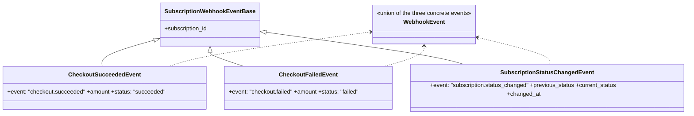
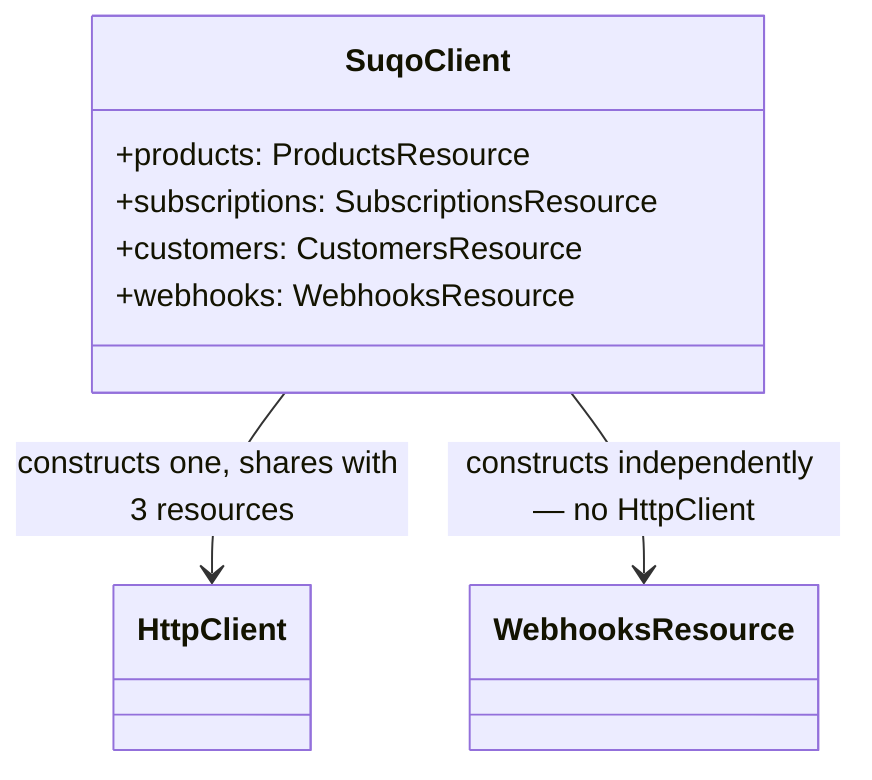

# Design Doc — Ticket 5: Webhooks

**Status:** Draft — backfilled after implementation.
**Audience:** any language SDK team (TypeScript, Python, PHP, …). Nothing below is TypeScript-specific;
where the current implementation makes a TS-specific choice, it's called out separately so another
language can make its own idiomatic equivalent.

---

## 1. Spec alignment

This ticket implements:

- **SDK-SPEC.md §9** — the webhook signature-verification helper in full: HMAC-SHA256 over
  `"<timestamp>." + <raw body bytes>`, constant-time comparison, and a caller-supplied max-age to
  defeat replay.
- **SDK-SPEC.md §5** — `client.webhooks.verify(...)` as part of the public surface.
- **typescript-addendum.md §9** — the concrete TS mechanism (`crypto.createHmac`,
  `crypto.timingSafeEqual`) and the Express usage pattern.
- **`docs/implementation-plan.md` Ticket 0 item 2** — the three event payload shapes, resolved
  2026-08-17 and re-verified live against `suqo.ai/docs/api/webhooks` on 2026-08-25.
- **SDK Naming Map v1.1** — confirms `webhooks.verify(params)` (a single params container) and the
  `webhooks` namespace name itself; explicitly notes the verifier is package-level in Go, "since it
  makes no network call and needs no key." The map has **no coverage at all** of the event payload
  *fields* (no row for `CheckoutSucceededEvent`, no rename-register entry for `amount`/
  `subscription_id`) — flagged separately to the lead as a gap, not something this ticket resolved
  on its own authority.

---

## 2. Decomposition

| Step | Piece | Depends on |
|---|---|---|
| A | Event payload types | nothing |
| B | `verify()` — the signature check itself | Step A only incidentally (reuses `SubscriptionStatus`) |
| C | Wiring onto `SuqoClient` | Step B |

Unlike Tickets 2–4, there's no HTTP layer involved anywhere in this ticket — Step B is pure,
synchronous, local computation. That's the single fact that shapes every other decision below.

---

## Step A — Event payload types

### Type diagram



### Contracts

| Rule | Detail |
|---|---|
| **Deliberately snake_case** | Every other model type in this SDK is camelCase, converted explicitly from the wire by a deserializer (Ticket 4). These three types are the one exception: `verify()` never parses the body — it only checks the signature and returns a `boolean`. A caller runs `JSON.parse(rawBody)` themselves, and that genuinely produces snake_case keys, since nothing converts them. Typing these as camelCase would describe a shape that doesn't exist at runtime — the same class of bug found (and fixed) twice in Ticket 4's resource layer, avoided here by not making the mistake in the first place. |
| **`subscription_id` factored into `SubscriptionWebhookEventBase`** (added 2026-08-25, per the lead's request) | All three confirmed events share this field, but the base is named for *subscription* events specifically, not a generic `BaseWebhookEvent` — `subscription_id` is common here because all three happen to be about a subscription, not because every event SUQO will ever send is guaranteed to carry one. A future event about a different resource (e.g. customer- or payout-level) would need its own base, not be forced through this one. Not exported — an internal implementation detail; only the three concrete event types and the `WebhookEvent` union are public. |
| `amount` stays a string | Decimal string, never coerced to a number — SDK-SPEC.md §9, consistent with every other money-shaped field in the SDK. |
| `status` is a literal, not the general enum | `"succeeded"`/`"failed"` are always exactly that one value per event — narrower than reusing a general payment-status enum that doesn't exist elsewhere in this API. |
| `previous_status`/`current_status` reuse `SubscriptionStatus` | Same values as `Subscription.status` elsewhere in the SDK (`openapi.yaml`'s `SubscriptionStatus` schema) — no reason to invent a second enum for the same wire values. |
| Not exhaustive | `WebhookEvent` only covers the three confirmed shapes. A caller should narrow on `event` before trusting the rest, the same way they'd handle any tagged union from an external source that might grow. |

### Conformance checklist — Step A

- [ ] All three event types use snake_case field names matching `suqo.ai/docs/api/webhooks`'s
      documented examples exactly.
- [ ] `amount` is typed as a string in both checkout events, never a number.
- [ ] `previous_status`/`current_status` accept the same values as `Subscription.status` elsewhere
      in the SDK, not a separately-defined, possibly-drifting enum.
- [ ] `SubscriptionWebhookEventBase` is not exported from the public surface — only the three
      concrete event types and `WebhookEvent` are.

---

## Step B — `verify()`

### Function contract

```
function verify(options: {
  rawBody: string | bytes,
  signature: string,
  timestamp: string,
  secret: string,
  toleranceSec: integer = 300,
}) -> boolean
```

### The algorithm

```
1. If signature doesn't start with "sha256=" → false
2. If the hex portion after "sha256=" isn't valid hex → false
3. If timestamp is empty/whitespace-only, or doesn't parse to a finite number → false
4. If |now_seconds - timestamp| > toleranceSec → false        (replay/staleness defense)
5. expected = hex(HMAC-SHA256(secret, "{timestamp}." + rawBody))
6. If length(provided bytes) != length(expected bytes) → false
7. Return constant_time_equal(provided bytes, expected bytes)
```

| Rule | Why |
|---|---|
| Never throws | Every failure mode returns `false` — a caller checking a webhook should never need a `try`/`catch` just to call this. |
| Hex-format check before decoding (step 2) | Hex decoders in several languages (JavaScript's `Buffer.from(str, "hex")` included) silently truncate at the first invalid character instead of raising an error — a malformed signature could otherwise decode to a shorter-than-expected byte sequence rather than being rejected for what it actually is: malformed. |
| Length check before the constant-time compare (step 6) | A constant-time-compare primitive in most languages either throws or is undefined behavior on mismatched lengths — checked explicitly first. This doesn't leak anything meaningful: the correct length (32 bytes for SHA-256) is public knowledge already, not a secret. |
| Absolute value in the timestamp check (step 4) | Rejects a timestamp too far in either direction — too old (a replayed old delivery) or implausibly far in the future (clock skew or a crafted value) — rather than only checking one direction. |
| Operates on **raw, unparsed bytes** | SDK-SPEC.md §9's single most-cited real-world failure: verifying against a body that passed through `JSON.parse` → `JSON.stringify` first. Whitespace and key order can change on that round-trip even though the *meaning* is unchanged, which silently breaks the signature. The helper must never be handed anything but the exact original bytes. |
| Never stores or logs the secret | It's supplied fresh on every call by the host application — this function holds no state between calls at all. |

### Conformance checklist — Step B

- [ ] A genuinely valid signature/timestamp/secret combination returns `true`.
- [ ] A tampered body (even a single byte changed) returns `false`.
- [ ] A timestamp older than `toleranceSec` returns `false`; one within a wider, caller-supplied
      `toleranceSec` returns `true` for the same delivery.
- [ ] A body that was JSON-parsed and re-stringified (not the original raw bytes) fails
      verification even though it's logically the same data — proves the check is byte-sensitive.
- [ ] A signature missing the `sha256=` prefix, containing invalid hex, an empty timestamp, or a
      non-numeric timestamp all return `false` — none of them throw.
- [ ] Both a `string` and a `Buffer`/raw-bytes form of the same body verify identically.

---

## Step C — Wiring onto `SuqoClient`



`WebhooksResource` is the one resource that does **not** take the shared `HttpClient` in its
constructor — it has nothing to call over the network, so there's nothing to share.

### Conformance checklist — Step C

- [ ] `suqo.webhooks.verify(...)` is reachable and functional through a constructed `SuqoClient`,
      with no dependency on `apiKey`/`baseUrl`/network configuration at all.
- [ ] Constructing a `SuqoClient` with a deliberately invalid `apiKey` still fails at the point
      `SdkConfig` validates it (SDK-SPEC.md §2) — `webhooks` isn't reachable at all in that case,
      same as every other resource, since construction never partially succeeds.

---

## Design decisions & rationale

1. **HMAC-SHA256 (a shared-secret scheme), not RSA/asymmetric signing.** RSA's advantage is
   letting many independent, less-trusted parties verify a signature without being able to forge
   one themselves. That advantage doesn't apply here: there is exactly one verifier per secret —
   the seller who owns it — and no second audience relying on that seller's check being
   unforgeable. HMAC is simpler, requires no key-pair infrastructure, and is what every comparable
   webhook provider (Stripe, GitHub, etc.) already uses for the same reason.

2. **Event payload types are the one deliberate snake_case exception in this SDK** — covered fully
   in Step A above. Recorded here too since it's a genuine, cross-cutting departure from every
   other ticket's camelCase convention, not a one-off detail.

3. **`WebhooksResource` takes no constructor dependencies.** Every other resource needs the shared
   `HttpClient` to do its job; this one needs nothing at all beyond what's passed into `verify()`
   itself. Giving it a constructor with no required arguments (rather than, say, forcing it to
   accept an unused `HttpClient` just for API consistency with the other three) is honest about
   what it actually depends on.

---

## What's intentionally not in this doc

- **Parsing the webhook body into a typed `WebhookEvent`.** `verify()` only checks the signature;
  no function in this ticket turns `rawBody` into a `WebhookEvent` object. If that's added later,
  it would need its own deserializer (converting to camelCase, the same pattern as Ticket 4's
  resources) and its own design decision — not assumed here.
- **RSA/asymmetric signing** — considered and explicitly rejected (see design decision 1), not
  built, since the shared-secret model already fits this use case.
- **`docs/webhooks.md`** (end-user documentation) — a later documentation ticket, not this one.
